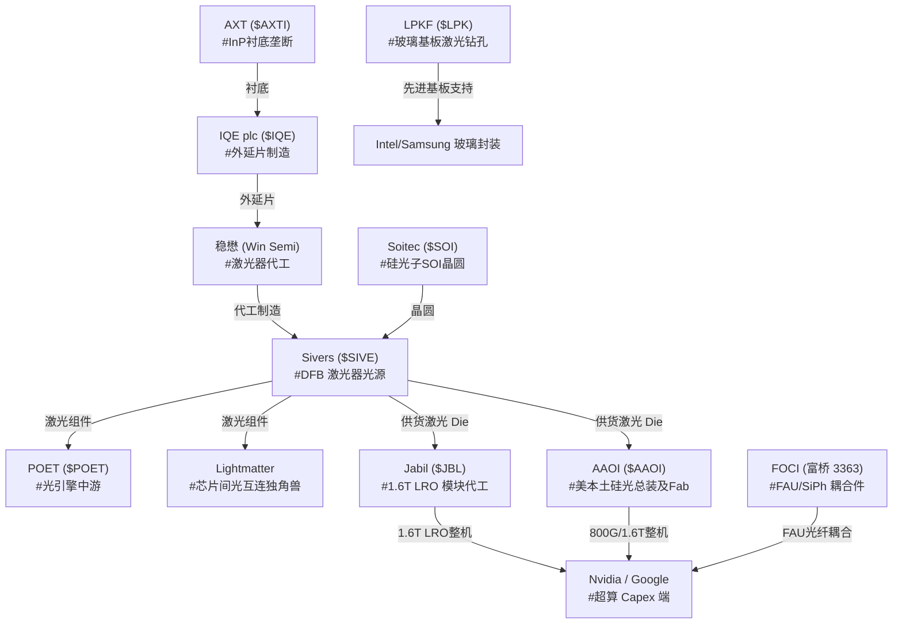

# 🧭 个人投资知识库第一期：硅光/CPO 供应链与物理智能深度研报

> **归档编码**：`Report-2026-05-25-Serenity-Analyst-Wiki`
> **数据源**：@aleabitoreddit (Serenity) X.com 历史归档推文（852 条）
> **汇编引擎**：Antigravity Personal KB Compiler
> **状态**：已正式归档 (Archived in `wiki/reports/`)

---

## 🧭 引言 (Executive Summary)

本报告为**个人投资知识库**的创刊号。根据 **Andrej Karpathy** 倡导的“LLM 编译个人知识库”架构，我们成功对美股头号半导体独立散户 Serenity 的 852 条深度推文进行了结构化“编译”，在本地构建了完整的 `wiki/` 知识网络。

本期报告重点聚焦于 **SiPh (硅光子学)** 与 **CPO (共封装光学)** 的超级周期导入，深入拆解阻碍整个 AI 物理网络层扩容的四大**底层物理/材料 chokepoints**，并梳理出个股研究与供应链流转的最佳路径。

---

## 🧪 核心支柱一：未知的结构性瓶颈（Unknown Structural Bottlenecks）

在整个光模块与硅光子学的快速迭代中，市场往往被终端应用（如 800G/1.6T Pluggables）的繁荣所迷惑，从而忽视了决定量产节奏的底层结构性限制：

### 1. 光学共封装 (CPO) 光源的唯一性与 Sivers Moat
*   **物理机制**：CPO 架构要求将光模块从传统可插拔形态直接移至靠近交换机 ASIC 芯片的同一片基板上，由于基板热密度和功耗极限，传统激光器（如 EML）无法满足散热指标。必须使用高性能的 CW（连续波）多通道 DFB（分布反馈）外部光源（ELS）进行高功率低热损耗供光。
*   ** chokepoint 状态**：Sivers Semiconductors ($SIVE) 是目前行业中绝无仅有的拥有高功率、多通道、低热损 DFB 激光阵列商业 IP 的设计商。主流中游光引擎（Ayar Labs, Celestial AI, Lightmatter, Lightelligence, POET）在物理层面上高度契合并绑定了 Sivers 的光源 IP，导致其在事实上拥有极强的议价权（Pricing Power）。
*   **产能卡脖子**：稳懋半导体 (Win Semi) 是其晶圆制造的核心 bottleneck，Sivers 已经在 2025 年 3 月的战略协议中提前锁定了稳懋的量产线。

### 2. 化合物半导体基底瓶颈：InP（磷化铟）衬底
*   **物理机制**：要制造 CPO 及 Pluggable 光模块所需的光源二极管（Laser Die），必须在 InP（磷化铟）衬底上进行外延片生长（Epiwafer）。
*   ** chokepoint 状态**：AXT Inc. ($AXTI) 与住友电工 ($SMTOY) 联手把持了全球 70%+ 的高纯度 InP 衬底供应。AXT 因在中美稀缺半导体物资博弈中的垄断地位，已被列入白宫关键物资短缺警告，成为典型的“战争溢价”标的。

### 3. 先进封装的物理极限：玻璃基板 (Glass Substrates) 与 TGV 钻孔
*   **物理机制**：当先进计算（CPU/GPU）与 HBM 存储在封装层面逼近物理上限，传统有机基板由于变形翘曲和带宽物理衰退，正被以 Intel 和三星为首的巨头强力切换为**玻璃基板**。
*   ** chokepoint 状态**：德国 LPKF ($LPK) 是玻璃基板激光诱导深蚀孔（TGV）制程的绝对垄断设备商，拥有全球 ~80% 的封装厂商订单份额，被称为“玻璃封装界的 ASML”。

---

## 🗺️ 核心支柱二：标的与供应链图谱（Ticker & Supply Chain Mapping）

基于已编译的 `wiki/tickers/` 个股数据库，供应链流转图谱可由如下 Mermaid 进行高度概括：

---

## 📈 核心支柱三：逻辑主线演变（Thesis Evolution）

通过对 2025 年 1 月到 2026 年 5 月的推文时序提炼，Serenity 的逻辑演进展现出以下明显的季度级拐点：

1.  **2025 Q1 - Q3：材料瓶颈的早期溢价**
    *   *叙事逻辑*：重仓 $AXTI (InP 衬底) 和 $SOI (硅光晶圆)，当市场质疑其价值时，强调“硅光子的物理基础没有备胎”，AXTI 随后暴涨 10x，Soitec 从 $40 定价重回 $140+。
2.  **2025 Q4 - 2026 Q1：中游商业化与量产时刻表对齐**
    *   *叙事逻辑*：随着 Jabil 明确 1.6T LRO 通信导入、POET 斩获 5000 万商业合同，逻辑转向“验证具有量产和锁定了制造产能的实际标的”，Sivers 因锁定稳懋产能并获得 Jabil 11kW 低功耗背书，成为新的重仓核心。
3.  **2026 Q2 至今：资本流动性与地缘安全背书**
    *   *叙事逻辑*：Sivers 重构董事会（全美系 GFS/CITI 班底），全面从瑞典斯德哥尔摩切往美国 NASDAQ 并购路线；获美国《芯片法案》660 万美元国防背书，击穿瑞典当地 17% 的空头头寸。流动性与地缘安全成为估值重构的第一驱动力。

---

## ⚖️ 核心支柱四：风险与流动性矩阵（Risk & Liquidity Matrix）

*   **技术更迭风险 (Obsolescence)**：可插拔（Pluggables）与 CPO 架构并存。虽然中游拼杀惨烈（AAOI 与 Lumentum 对垒），但 Sivers (光源) 与 AXT (InP) 作为产业链上游的公共要素，极好地对冲了下游客观更迭带来的单一损耗风险。
*   **融资稀释风险 (Dilution)**：小市值标的具有天生的高波性与融资稀释惯性（如 Sivers 即将迎来的 15% 并购稀释案、AAOI 6 亿美金稀释）。Thesis 必须将其视为“获取扩张 TAM 和进入 NASDAQ 主流机构订单 mandated 市值范围的必要成本”。
*   **指数流入与被动买盘 (Liquidity Squeeze)**：欧洲及台湾本地的利基小盘股（如富桥 3363、Sivers）由于 MSCI 和 NASDAQ 的重组纳入，正吸引数十亿美金的 ETF 被动买盘，这是小市值空头极度致命的挤压要素。

---

> [!NOTE]
> 本报告已正式作为 Wiki 的本地永久归档。任何在未来发生的问答交互及最新推文抓取，都将在 `wiki/index.md` 主门户中进行挂载，您可以直接使用 Obsidian 软件将工作区根目录下的 `wiki/` 文件夹作为一个独立的 **Vault** 打开，从而获得极其震撼的可视化关系网络图谱！
